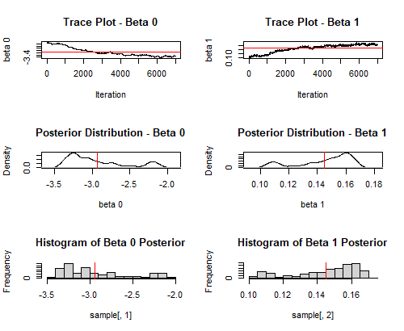
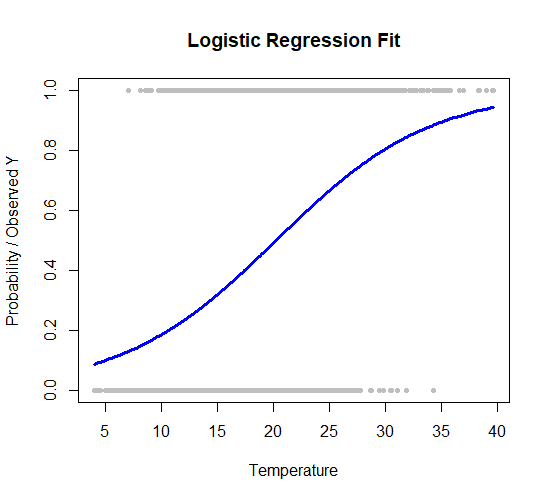
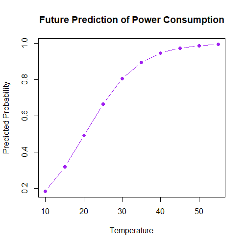

# Energy Consumption Prediction using Bayesian Logistic Regression

## Overview
This project analyzes energy consumption data from Tetuan City and builds a predictive model to estimate the probability of high energy usage based on temperature.

A Bayesian Logistic Regression model was implemented using the Random Walk Metropolis (MCMC) algorithm to estimate model parameters and capture uncertainty in predictions.

---

## Objectives
- Analyze energy consumption patterns  
- Identify relationship between temperature and energy usage  
- Build a probabilistic classification model  
- Apply Bayesian inference using MCMC  
- Evaluate model performance  

---

## Dataset
The dataset includes:
- Temperature  
- Zone 1, Zone 2, Zone 3 power consumption  

Total power consumption was calculated by combining all zones.

---

## Methodology

### Data Preprocessing
- Removed duplicate values  
- Split dataset into training and testing sets  
- Created binary target variable:
  - 1 → High consumption  
  - 0 → Low consumption  

---

### Model
- Bayesian Logistic Regression  
- Parameters estimated using Random Walk Metropolis Algorithm (MCMC)  

---

## Model Diagnostics

### Trace Plots
Trace plots show the convergence of MCMC samples for model parameters.

## Model Diagnostics

### Trace Plots & Posterior Distributions
Trace plots show the convergence of MCMC samples for model parameters.
Density plots illustrate the distribution of estimated coefficients.

---

### Logistic Regression Fit
Relationship between temperature and probability of high energy consumption.

---

### Future Predictions
Predicted probability for different temperature values.

)

---

## Results

- Model successfully captures relationship between temperature and energy consumption  
- Higher temperatures increase probability of high energy usage  
- Model shows good predictive performance on test data  

---

## Evaluation Metrics

- Accuracy: 0.666  
- Precision: 0.646  
- Recall: 0.585  
- F1 Score: 0.614
---

## Predictions
- Predicted probability of high energy consumption for different temperature values  
- Future predictions generated for temperature range (10°C – 55°C)  

---

## Tools & Technologies
- R Programming  
- Bayesian Statistics  
- MCMC (Random Walk Metropolis)  
- Data Visualization  

---

## Project Structure
Energy-consumption-analysis/
│
├── data/
├── scripts/
├── images/
├── README.md

---

## How to Run
1. Open the R script  
2. Load dataset  
3. Run the code to perform analysis and modeling  

---

## Author
Gayathri Karagoda Pathiranage  
Aspiring Data Analyst  
